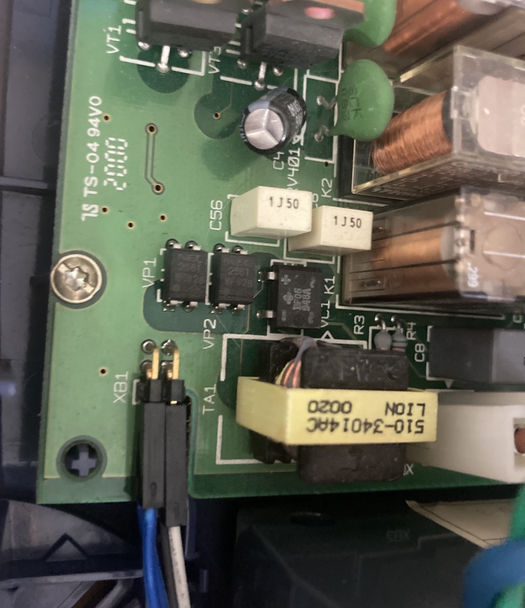
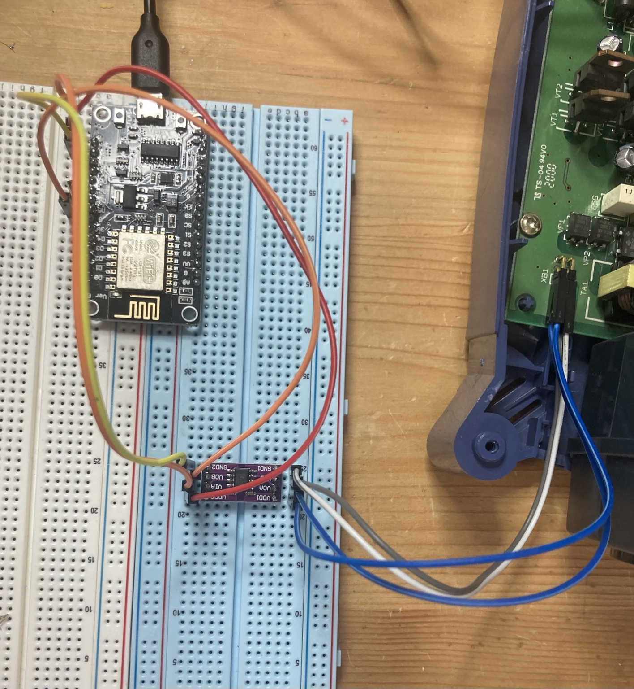

# Hardware

## ESP8266

Target board: LOLIN/WEMOS D1 mini (ESP8266).

## UPS serial connection

Current test sketch uses:

- D6: RX
- D5: TX
- 2400 baud
- 8 data bits
- no parity
- 1 stop bit

The UPS interface is intended to be isolated through an ADuM1201.

## Flashing

For the current LOLIN/CH340 setup, the reproducible flashing procedure uses the NodeMCU Firmware Programmer:

- select the generated Arduino .bin
- address 0x00000
- 57600 baud
- 4 MByte flash
- 40 MHz
- DIO
- put the ESP8266 into bootloader manually with FLASH + RST
- start Flash(E) while the board is in the bootloader

Do not run another serial monitor on COM3 while flashing.

## Flashing note: USB reconnect

On the current laptop/LOLIN setup, the NodeMCU Firmware Programmer does not always detect the ESP8266 immediately. If the programmer only shows "Serial port connected" and "Begin find ESP8266" but no "ESP8266 ACK success", unplug the LOLIN from USB and reconnect it, then repeat the manual bootloader sequence and start Flash(E).

The known working sequence is:

1. Close Arduino IDE and any serial monitor so COM3 is free.
2. If the programmer does not get an ACK, unplug and reconnect the LOLIN USB connection.
3. Hold FLASH.
4. Press and release RST.
5. Keep FLASH held while starting Flash(E) in the NodeMCU Firmware Programmer.
6. Release FLASH once the programmer responds.

Do not run esptool chip-id immediately before using the NodeMCU programmer. esptool performs a hard reset via RTS afterwards, which leaves the ESP8266 bootloader and can prevent the programmer from getting its ACK.

## Test setup and UPS connection

The following photos document the actual hardware setup used during SHUT/HID reverse engineering and control testing.

### UPS board connection

Serial connection at the UPS controller board used for the SHUT interface tests.

### ESP8266 test setup

LOLIN/WEMOS D1 mini test setup with the isolated serial interface connected to the MGE Ellipse UPS.

## WLAN

Der ESP8266 nutzt ausschließlich 2,4 GHz. Ab Firmware v0.12.3 unterstützt die WLAN-Seite Netzwerk-Scan und RSSI-basiertes Roaming zwischen Access Points mit identischer SSID. Standardmäßig wird ab schlechter als -72 dBm nach einem besseren AP gesucht; gewechselt wird erst ab mindestens 4 dB Verbesserung.
